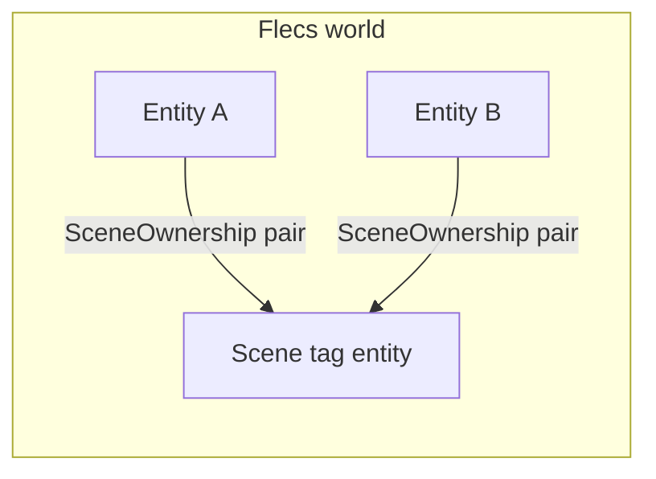
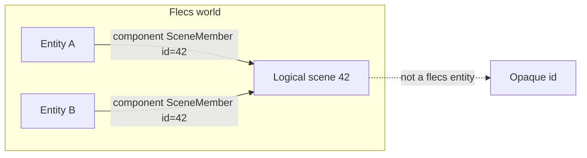

# Data-only scene identity vs pair-based `SceneOwnership`

This compares **two** ways to express “this entity belongs to scene S” in a single shared `flecs::world`, in the context of your current code ([`Scene.cpp`](engine/wayfinder/src/scene/Scene.cpp), [`Components.h`](engine/wayfinder/src/scene/Components.h)).

---

## A. Current approach: pair tag + `SceneOwnership` (what you have)

**Shape**

- One **`flecs::entity` per `Scene`** instance: `m_sceneTag` — used as the **second** element of a pair.
- Empty tag: [`SceneOwnership`](engine/wayfinder/src/scene/Components.h) with usage `entity.add<SceneOwnership>(m_sceneTag)`.
- **Cached query**: `m_ownedEntitiesQuery = query_builder<>().with<SceneOwnership>(m_sceneTag).build()` — Flecs indexes “all entities with this exact pair.”



**Pros**

- **Native Flecs**: Membership is a **relationship**; one query gives “all members of this scene” without scanning unrelated entities.
- **Isolation**: `has<SceneOwnership>(tagA)` vs `tagB` is clear for multi-scene ([`ECSIntegrationTests` cross-scene case](tests/scene/ECSIntegrationTests.cpp)).
- **No duplicate “list of entities”** required for enumeration if you trust the query as SoT.

**Cons**

- **Scene identity is a `flecs::entity`**. Anything that uses that id as a **pair second in query terms** interacts with Flecs **delete-lock** semantics when you try to `ecs_delete` the tag — the problem you investigated.
- **Lifecycle coupling**: Unloading a “scene” touches ECS entity deletion order, deferred merges, and query teardown.

---

## B. Data-only approach: scene id on a component (no pair target)

**Shape**

- **Scene identity is not “a Flecs entity used as pair second.”** It is an **opaque value**: e.g. `uint64_t`, `SceneInstanceId`, or a small strong type (new type, not `flecs::entity`).
- Component carries **data**, not a relationship target, for example:

```cpp
// Illustrative — not existing code
struct SceneMember {
    SceneInstanceId SceneId;  // or uint64_t, UUID bytes, etc.
};
```

- On spawn: `entity.set<SceneMember>({ sceneInstanceId })` (and you may still keep [`SceneObjectIdComponent`](engine/wayfinder/src/scene/Components.h) for object identity — orthogonal).



**How you enumerate “all entities in scene 42”**

There is **no** single Flecs primitive that is *exactly* “archetype + field equality” in all versions without extra setup. Typical patterns:

1. **Authoritative C++ set (common with data-only)**  
   `Scene` maintains `std::unordered_set<flecs::entity_t>` (or relies on existing [`m_entitiesById`](engine/wayfinder/src/scene/Scene.h) / name maps) as **SoT** for membership. Save/load and shutdown **iterate that**, not a Flecs query on a pair. ECS still stores `SceneMember` for **validation** and for **systems** that only need a quick check.

2. **Broad ECS query + filter**  
   `world.query<SceneMember>()` (or filter) and **compare** `SceneMember.SceneId == activeId` in the loop. Simpler API, **worse scaling** if the world is huge and many scenes exist (you touch every `SceneMember`).

3. **Flecs query features** (version-dependent)  
   If you adopt features that allow **matching a specific component value** (or a tag per scene without using the tag entity as a **deletable** pair target in the same way), you can narrow the search — that becomes an **implementation detail** of your Flecs version.

**Teardown**

- “Destroy scene” = destroy **all entities that belong to session id X** using **your** registry and/or one broad query + id check — **no** `ecs_delete` of a “scene tag entity” used in pair queries, so **no** pair-target delete-lock from that pattern.
- The **opaque id** can be **retired** in `Scene` state (counter) without touching Flecs entity allocation for “the scene itself.”

**Pros**

- **Decouples** scene unload from **Flecs relationship target deletion**.
- **Closer to Bevy-style** thinking: “membership is **data on components**,” not an edge to another entity you might delete.
- **Explicit SoT**: You choose whether **ECS** or **`Scene`** owns the list of entities — forces a clear contract.

**Cons**

- **Risk of drift**: If both `SceneMember` and a C++ map claim membership, they must stay in sync (add/remove hooks).
- **Query cost** if you use “query all `SceneMember` + filter” naively on a large world.
- **Less “pure Flecs graph”** aesthetics — more application-layer bookkeeping.

---

## Side-by-side comparison

| Dimension | Pair `SceneOwnership(tag)` (current) | Data-only `SceneMember { id }` |
|-----------|----------------------------------------|----------------------------------|
| Scene identity | `flecs::entity` (tag) | Opaque id (not a queried pair target) |
| “All entities in scene” | One indexed query on `(SceneOwnership, tag)` | Registry iteration, or broad query + value filter, or advanced Flecs filter if available |
| Multi-scene isolation | Natural via different tags | Natural via different `SceneId` values |
| Shutdown / delete story | Must respect query locks on **tag entity** | No tag entity to delete for membership; delete entities by list or query+filter |
| Duplication risk | Low if query is SoT | Medium unless you pick **one** SoT (map vs ECS) |
| Flecs “idiomatic” | High (relationships) | Medium (components + app logic) |
| Future-proof vs Flecs internals | Sensitive to pair + query + delete rules | Less sensitive; more work in your code |

---

## What would actually change in Wayfinder (if you pivoted)

Rough scope (for awareness, not execution in this doc):

- Replace `add<SceneOwnership>(m_sceneTag)` with `set<SceneMember>({ id })`; remove `m_sceneTag` **as membership** (optional: keep a **non-queried** scene root entity only for hierarchy — separate concern).
- Replace [`m_ownedEntitiesQuery`](engine/wayfinder/src/scene/Scene.h) with either **map iteration** or a **value-filter** strategy.
- Update [`Entity.cpp`](engine/wayfinder/src/scene/entity/Entity.cpp) checks from `has<SceneOwnership>(GetSceneTag())` to `get<SceneMember>().SceneId == mySceneId` (or equivalent).
- Tests in [`ECSIntegrationTests.cpp`](tests/scene/ECSIntegrationTests.cpp) updated to assert on **id** / membership, not pair tags.

---

## Recommendation (design only)

- If the goal is **minimum Flecs lifecycle surprises** and you accept **explicit bookkeeping**: **data-only + authoritative `Scene` registry** (or maps you already have) is **robust** and easy to reason about.
- If the goal is **maximum Flecs-native queries** with **one** relationship query: keep **pair**, but adopt a **tag lifecycle policy** (persistent root or pool — see [scene tag plan](.cursor/plans/scene_tag_flecs_fix_2cb9a460.plan.md)) so you **never** fight `ecs_delete` on a queried pair target during normal teardown.

Neither is “wrong”; they trade **engine-internals coupling** vs **application bookkeeping**.
