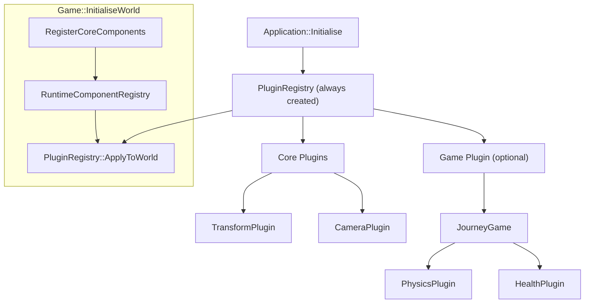

# Modular ECS Registration: Unified Plugin Architecture

## Context

Issue #123 asks us to extract per-domain modules from the monolithic `Scene::RegisterCoreECS`. Rather than a narrow extraction, we're taking the opportunity to clean up the entire plugin/module naming and architecture while the cost is low. This unifies engine-internal and game registration under a single `Plugin` concept, matching Bevy's model.

## Naming Changes

| Before | After | Rationale |
|--------|-------|-----------|
| `Module` (class) | collapsed into `Plugin` | One concept instead of two; Plugin gains lifecycle hooks |
| `ModuleRegistry` | `PluginRegistry` | Describes who uses it -- plugins register into it |
| `ModuleLoader` / `LoadedModule` | `PluginLoader` / `LoadedPlugin` | Follows the class rename |
| `ModuleExport.h` | `PluginExport.h` | Follows the class rename |
| `WAYFINDER_IMPLEMENT_MODULE` | `WAYFINDER_IMPLEMENT_GAME_PLUGIN` | Communicates purpose: this is the game's root plugin |
| `CreateModule()` | `CreateGamePlugin()` | Explicit that this creates the game's entry-point plugin |
| `WayfinderCreateModule` / `WayfinderDestroyModule` | `WayfinderCreateGamePlugin` / `WayfinderDestroyGamePlugin` | DLL export symbols |
| `Module::Register()` | subsumed by `Plugin::Build()` | Same role, unified interface |
| `RegisterCoreECS` | `RegisterCoreComponents` | After extraction it only registers component types |
| `src/modules/` directory | `src/plugins/` | Matches the concept rename |
| `m_moduleRegistry` (everywhere) | `m_pluginRegistry` | Member naming consistency |
| `m_module` / `m_moduleStarted` | `m_gamePlugin` / `m_gamePluginStarted` | Clarity |

## Architecture



All plugins -- core and game -- flow through the same `PluginRegistry::ApplyToWorld()` call. The `PluginRegistry` is always created, even without a game plugin.

## Design Decisions

- **Plugin gains lifecycle hooks.** `OnStartup()` and `OnShutdown()` (both default no-op) move from the deleted `Module` into `Plugin`. `PluginRegistry` stores all plugin instances and calls hooks in registration order (startup) / reverse order (shutdown). Most plugins won't override them.
- **`PluginRegistry::AddPlugin` gets an instance overload.** Template `AddPlugin<T>()` constructs and builds. New `AddPlugin(std::unique_ptr<Plugin>)` accepts an externally-created plugin (needed for the game plugin from `CreateGamePlugin()` or `PluginLoader`).
- **`RegisterCoreComponents` stays as a static method on `Scene`.** It registers component types (`world.component<T>()`) for scene infrastructure. This keeps ~40 test call sites working unchanged. Systems move to plugins.
- **No `PluginGroup` / `DefaultPlugins` bundle yet.** Core plugins are added directly in `Application::Initialise()`. A bundle concept can come later.
- **No flecs `world.module<T>()`** -- our `Plugin` is the grouping unit. Flecs modules could be an internal optimisation later.

## Detailed Changes

### 1. Collapse Module into Plugin

[`Plugin.h`](engine/wayfinder/src/modules/Plugin.h) (will move to `src/plugins/Plugin.h`):

```cpp
class WAYFINDER_API Plugin
{
public:
    virtual ~Plugin() = default;

    virtual void Build(PluginRegistry& registry) = 0;
    virtual void OnStartup() {}
    virtual void OnShutdown() {}
};

extern std::unique_ptr<Plugin> CreateGamePlugin();
```

Delete [`Module.h`](engine/wayfinder/src/modules/Module.h) entirely -- its interface is fully subsumed.

### 2. Rename ModuleRegistry -> PluginRegistry

Rename files: `ModuleRegistry.h/.cpp` -> `PluginRegistry.h/.cpp`. Rename class. Add instance overload:

```cpp
void AddPlugin(std::unique_ptr<Plugin> plugin)
{
    plugin->Build(*this);
    m_plugins.push_back(std::move(plugin));
}
```

`PluginRegistry` gains lifecycle management:

```cpp
void NotifyStartup();   // calls OnStartup() on all plugins in order
void NotifyShutdown();  // calls OnShutdown() in reverse order
```

Type aliases like `PluginRegistry::ComponentDescriptor`, `PluginRegistry::SystemDescriptor` carry over unchanged.

### 3. Rename ModuleLoader -> PluginLoader, ModuleExport -> PluginExport

- [`ModuleLoader.h/.cpp`](engine/wayfinder/src/modules/ModuleLoader.h) -> `PluginLoader.h/.cpp`
- `LoadedModule` -> `LoadedPlugin`, `ModuleLoader` -> `PluginLoader`
- DLL symbols: `WayfinderCreateGamePlugin` / `WayfinderDestroyGamePlugin`
- [`ModuleExport.h`](engine/wayfinder/src/modules/ModuleExport.h) -> `PluginExport.h`
- Macro: `WAYFINDER_IMPLEMENT_GAME_PLUGIN(PluginClass)`
- `WAYFINDER_MODULE_API` -> `WAYFINDER_PLUGIN_EXPORT`

### 4. Move `src/modules/` -> `src/plugins/`

Rename the directory. Update all `#include "modules/..."` -> `#include "plugins/..."` across:

| File | Includes to update |
|------|--------------------|
| `app/Application.h` | forward decls |
| `app/Application.cpp` | `plugins/Plugin.h`, `plugins/PluginRegistry.h` |
| `app/EntryPoint.h` | `plugins/Plugin.h` |
| `gameplay/Game.cpp` | `plugins/PluginRegistry.h` |
| `gameplay/GameContext.h` | forward decl rename |
| `gameplay/GameStateMachine.cpp` | `plugins/PluginRegistry.h` |
| `scene/RuntimeComponentRegistry.cpp` | `plugins/PluginRegistry.h` |
| `physics/PhysicsPlugin.h` | `plugins/Plugin.h` |
| `physics/PhysicsPlugin.cpp` | `plugins/PluginRegistry.h` |
| `PluginRegistry.h` (internal) | `plugins/registrars/...` |
| Tests: `ModuleRegistryTests.cpp` (rename to `PluginRegistryTests.cpp`) | all `plugins/...` includes |
| Tests: `PhysicsIntegrationTests.cpp`, `GameStateMachineTests.cpp` | `plugins/PluginRegistry.h` |
| Sandbox: `JourneyModule.cpp` (rename to `JourneyGame.cpp`) | `plugins/Plugin.h`, `plugins/PluginExport.h`, `plugins/PluginRegistry.h` |
| Sandbox: `WaystoneApplication.cpp` | `plugins/Plugin.h`, `plugins/PluginRegistry.h` |
| Tools: `WaypointMain.cpp` | `plugins/PluginLoader.h`, `plugins/PluginRegistry.h` |

### 5. Update Application

[`Application.h`](engine/wayfinder/src/app/Application.h): Accept `std::unique_ptr<Plugin>` instead of `std::unique_ptr<Module>`. Members:

```cpp
std::unique_ptr<Plugin> m_gamePlugin;
std::unique_ptr<PluginRegistry> m_pluginRegistry;
// ...
bool m_pluginsStarted = false;
```

[`Application.cpp`](engine/wayfinder/src/app/Application.cpp) `Initialise()`:

```cpp
m_pluginRegistry = std::make_unique<PluginRegistry>(*m_project, *m_config);

// Core engine plugins
m_pluginRegistry->AddPlugin<TransformPlugin>();
m_pluginRegistry->AddPlugin<CameraPlugin>();

// Game plugin (adds its own sub-plugins in Build)
if (m_gamePlugin)
{
    m_pluginRegistry->AddPlugin(std::move(m_gamePlugin));
}
```

After game init: `m_pluginRegistry->NotifyStartup()` replaces `m_module->OnStartup()`.
In Shutdown: `m_pluginRegistry->NotifyShutdown()` replaces `m_module->OnShutdown()`.

### 6. Update GameContext + Game

[`GameContext.h`](engine/wayfinder/src/gameplay/GameContext.h): `const PluginRegistry& pluginRegistry` (reference, not nullable pointer).

[`Game.h`](engine/wayfinder/src/gameplay/Game.h): `const PluginRegistry& m_pluginRegistry` (reference member, set from GameContext).

[`Game.cpp`](engine/wayfinder/src/gameplay/Game.cpp): Remove all `if (m_pluginRegistry)` null guards.

### 7. New files: TransformPlugin

- `engine/wayfinder/src/scene/plugins/TransformPlugin.h` -- `Plugin` subclass in `Wayfinder` namespace
- `engine/wayfinder/src/scene/plugins/TransformPlugin.cpp` -- `Build()` calls `registry.RegisterSystem("UpdateWorldTransforms", factory)` with the recursive propagation logic from lines 117-154 of [`Scene.cpp`](engine/wayfinder/src/scene/Scene.cpp). Phase: `flecs::PreUpdate`.

### 8. New files: CameraPlugin

- `engine/wayfinder/src/scene/plugins/CameraPlugin.h` -- `Plugin` subclass in `Wayfinder` namespace
- `engine/wayfinder/src/scene/plugins/CameraPlugin.cpp` -- `Build()` calls `registry.RegisterSystem("ExtractActiveCamera", factory)` with the camera extraction logic from lines 158-191 of [`Scene.cpp`](engine/wayfinder/src/scene/Scene.cpp). Phase: `flecs::OnUpdate`.

### 9. Simplify RegisterCoreECS -> RegisterCoreComponents

[`Scene.h`](engine/wayfinder/src/scene/Scene.h) + [`Scene.cpp`](engine/wayfinder/src/scene/Scene.cpp): Rename static method, strip system registration, keep component types only:

```cpp
static void RegisterCoreComponents(flecs::world& world);
```

```cpp
void Scene::RegisterCoreComponents(flecs::world& world)
{
    world.component<SceneEntityComponent>();
    world.component<SceneOwnership>();
    world.component<NameComponent>();
    world.component<SceneObjectIdComponent>();
    world.component<PrefabInstanceComponent>();
    world.component<WorldTransformComponent>();
    world.component<ActiveCameraStateComponent>();
}
```

Update all call sites (~40 in tests, 1 in `Game.cpp`, 1 in `WaypointMain.cpp`).

### 10. Update sandbox games

[`JourneyModule.cpp`](sandbox/journey/src/JourneyModule.cpp) -- rename file to `JourneyGame.cpp`, rename class:

```cpp
class JourneyGame : public Plugin
{
    void Build(PluginRegistry& registry) override
    {
        registry.AddPlugin<Physics::PhysicsPlugin>();
        registry.AddPlugin<HealthPlugin>();
        registry.AddPlugin<GameplayPlugin>();
        registry.AddPlugin<TagDemoPlugin>();
    }
};

std::unique_ptr<Wayfinder::Plugin> Wayfinder::CreateGamePlugin()
{
    return std::make_unique<Journey::JourneyGame>();
}

WAYFINDER_IMPLEMENT_GAME_PLUGIN(Wayfinder::Journey::JourneyGame)
```

Inline plugins (`HealthPlugin`, `GameplayPlugin`, `TagDemoPlugin`) update their `Build` signatures from `ModuleRegistry&` to `PluginRegistry&`.

[`WaystoneApplication.cpp`](sandbox/waystone/src/WaystoneApplication.cpp): Same pattern with empty `Build()`.

### 11. Update CMakeLists

[`engine/wayfinder/CMakeLists.txt`](engine/wayfinder/CMakeLists.txt):
- Rename `src/modules/*` entries to `src/plugins/*`
- Remove `Module.h` entry
- Add scene plugin files:

```
# Scene -- Plugins
src/scene/plugins/TransformPlugin.h
src/scene/plugins/TransformPlugin.cpp
src/scene/plugins/CameraPlugin.h
src/scene/plugins/CameraPlugin.cpp
```

[`tests/CMakeLists.txt`](tests/CMakeLists.txt): Rename `modules/ModuleRegistryTests.cpp` -> `plugins/PluginRegistryTests.cpp`.

Sandbox CMakeLists: Rename `JourneyModule.cpp` -> `JourneyGame.cpp` if referenced explicitly.

### 12. Update AGENTS.md

Update the "Module System" section in [`.github/AGENTS.md`](.github/AGENTS.md):
- Rename to "Plugin System"
- Update the pitfall about `Module::Register()` -> `Plugin::Build()` stores factories

### 13. Tests

- Rename `tests/modules/ModuleRegistryTests.cpp` -> `tests/plugins/PluginRegistryTests.cpp`
- Update test suite name from `"ModuleRegistry"` to `"PluginRegistry"`
- Update all `ModuleRegistry` references to `PluginRegistry` in test code
- Update `Scene::RegisterCoreECS` calls to `Scene::RegisterCoreComponents` (~40 call sites across 6 test files)
- No new tests needed for the extraction itself -- the existing system/component tests cover the behaviour

### 14. Tools

[`WaypointMain.cpp`](tools/waypoint/src/WaypointMain.cpp): Update includes, `ModuleLoader` -> `PluginLoader`, `LoadedModule` -> `LoadedPlugin`, `RegisterCoreECS` -> `RegisterCoreComponents`.

## File Inventory

**Deleted:** `Module.h`
**Renamed (content + path):** `ModuleRegistry.h/cpp`, `ModuleLoader.h/cpp`, `ModuleExport.h`, `ModuleRegistryTests.cpp`, `JourneyModule.cpp`
**New:** `TransformPlugin.h/cpp`, `CameraPlugin.h/cpp` (under `scene/plugins/`)
**Modified:** `Plugin.h`, `Application.h/cpp`, `EntryPoint.h`, `Game.h/cpp`, `GameContext.h`, `GameStateMachine.cpp`, `RuntimeComponentRegistry.cpp`, `PhysicsPlugin.h/cpp`, `Scene.h/cpp`, `WaystoneApplication.cpp`, `WaypointMain.cpp`, engine `CMakeLists.txt`, tests `CMakeLists.txt`, sandbox `CMakeLists.txt`, `AGENTS.md`, 6 test files (RegisterCoreComponents rename)

## Follow-up (not in this PR)

- `PluginGroup` / `DefaultPlugins` concept when more core plugins emerge
- Consider whether `RegisterCoreComponents` should also move into a `SceneInfrastructurePlugin`
- Future domains (animation, audio spatial) follow the same plugin pattern
