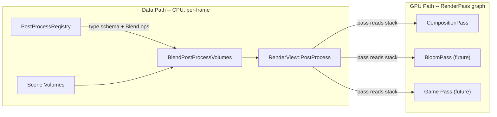

# Pluggable Composition + Open Post-Process Registry

## Architecture

Two separate concerns that are wired together by convention, not by automatic dispatch:



**Key rule:** The registry owns *data operations* (identity, lerp, serialise, deserialise). It does **not** insert render passes or drive GPU work. A `RenderPass` that wants to consume a registered effect type queries `PostProcessStack` by effect id. If no pass reads a registered type, the data is inert. If a pass queries an unregistered type, it gets null.

This means adding bloom later is: (1) define `BloomParams` struct with ADL functions, (2) `registry.Register<BloomParams>("bloom")`, (3) write a `BloomPass : RenderPass` that reads `stack.Find<BloomParams>(bloomId)`.

---

## Phase 1: Core Infrastructure

### 1.1 -- `Override<T>` template

**New file:** [engine/wayfinder/src/rendering/materials/Override.h](engine/wayfinder/src/rendering/materials/Override.h)

Header-only. Wraps a value + active flag:

```cpp
template<typename T>
struct Override {
    T Value;
    bool Active = false;

    static Override Inactive(T defaultValue) { return {defaultValue, false}; }
    static Override Set(T value) { return {value, true}; }
};
```

Provide a `LerpOverride` helper template that handles the active-gate logic and delegates the actual math to a caller-supplied callable:

```cpp
template<typename T, typename InterpFn>
Override<T> LerpOverride(const Override<T>& current, const Override<T>& source, float t, InterpFn&& interp)
{
    if (!source.Active) return current;
    return Override<T>{ .Value = interp(current.Value, source.Value, t), .Active = true };
}
```

This is the per-field sparse-override mechanism (matches Unity's model). No lambdas or function pointers stored in the struct -- the interp choice is made at the call site inside each type's hand-written `Lerp` function, not in `Override` itself. The struct stays trivially copyable and small.

Also provide a convenience default overload that uses `Maths::Mix`:

```cpp
template<typename T>
Override<T> LerpOverride(const Override<T>& current, const Override<T>& source, float t)
{
    return LerpOverride(current, source, t, [](const T& a, const T& b, float w) { return Maths::Mix(a, b, w); });
}
```

**Custom interpolation per field:** A developer writing a custom effect type picks whatever interp they want per field inside their `Lerp` ADL function. Standard cases use the default overload; non-linear cases (smoothstep, snap-on-threshold, slerp, spring) pass a lambda or function:

```cpp
MyParams Lerp(const MyParams& current, const MyParams& source, float t)
{
    MyParams result;
    result.Opacity  = LerpOverride(current.Opacity, source.Opacity, t);                    // default linear
    result.Rotation = LerpOverride(current.Rotation, source.Rotation, t, SlerpAngle);       // custom interp fn
    result.Toggle   = LerpOverride(current.Toggle, source.Toggle, t,                        // inline lambda
        [](float a, float b, float w) { return w > 0.5f ? b : a; });
    return result;
}
```

**Extra interp parameters** (spring stiffness, easing curve, etc.) are either captured in the lambda or stored as non-`Override` fields on the effect struct itself -- the hand-written `Lerp` has full access to both source and current structs.

This design is fully extensible by game developers: define a struct, write ADL functions using `LerpOverride` with whatever interp you want, register it.

### 1.2 -- `PostProcessRegistry`

**New files:**
- [engine/wayfinder/src/rendering/materials/PostProcessRegistry.h](engine/wayfinder/src/rendering/materials/PostProcessRegistry.h)
- [engine/wayfinder/src/rendering/materials/PostProcessRegistry.cpp](engine/wayfinder/src/rendering/materials/PostProcessRegistry.cpp)

Core types:

- **`PostProcessEffectId`** -- `uint32_t` handle. Runtime-only; string name is the stable identity for serialisation.
- **`PostProcessEffectDesc`** -- type-erased operations stored per registered type:
  - `CreateIdentity(void* dst)` -- placement-construct identity defaults
  - `Destroy(void* dst)` -- placement-destroy
  - `Blend(void* dst, const void* src, float weight)` -- calls the per-type hand-written `Lerp` ADL function
  - `Deserialise(void* dst, const json&)` -- calls per-type ADL `Deserialise`
  - `Serialise(json&, const void*)` -- calls per-type ADL `Serialise`
  - `Size`, `Align` -- for storage validation
  - `Name` -- string_view, stable identity for JSON type field

- **`BlendableEffect` concept** -- requires these ADL free functions on `T`:
  - `Lerp(const T& current, const T& source, float weight) -> T`
  - `Identity(Tag<T>) -> T`
  - `Deserialise(Tag<T>, const json&) -> T`
  - `Serialise(json&, const T&)`

  The `Tag<T>` pattern enables ADL dispatch without passing a `T` instance to identity/deserialise.

- **`Register<T>(string_view name) -> PostProcessEffectId`** -- generates a `PostProcessEffectDesc` from the concept, appends to internal vector, returns index-based id.

- **Seal model** (not lock-free): All `Register` calls happen during init (before first frame). After `Seal()` or first `Find` call, the vector is frozen. Lookups are plain vector index (O(1) by id) or linear scan by name (rare, serialisation only). No mutexes needed for the hot path.

- **`Find(PostProcessEffectId) -> const PostProcessEffectDesc*`** / **`Find(string_view name) -> optional<PostProcessEffectId>`**

### 1.3 -- Rework `PostProcessEffect` and `PostProcessStack`

**Modified file:** [engine/wayfinder/src/rendering/materials/PostProcessVolume.h](engine/wayfinder/src/rendering/materials/PostProcessVolume.h)

Remove:
- `PostProcessEffectType` enum
- `PostProcessEffectPayload` variant (`std::variant<monostate, ColourGradingParams, BloomParams>`)
- `PostProcessEffect::ParseTypeString` / `TypeToString`
- `BloomParams` struct

New `PostProcessEffect`:
```cpp
struct PostProcessEffect {
    PostProcessEffectId TypeId{};
    bool Enabled = true;
    // SBO: inline storage for small effect structs (covers all current engine types).
    // If a registered type exceeds this, Register<T> static_asserts at compile time.
    // Future: heap fallback if game types need it.
    static constexpr size_t PAYLOAD_CAPACITY = 96;
    alignas(16) std::byte Payload[PAYLOAD_CAPACITY]{};
};
```

96 bytes covers `ColourGradingParams` with `Override<>` wrappers (8 fields x ~8 bytes each = ~64 bytes plus padding) and leaves room for reasonable game types. `Register<T>` uses `static_assert(sizeof(T) <= PAYLOAD_CAPACITY)` so violations are caught at compile time. If game code needs larger types, bump the constant or add a heap fallback later -- but document that effects should be small POD-like parameter blocks, not containers.

New `PostProcessStack`:
```cpp
struct PostProcessStack {
    SmallVector<PostProcessEffect, 4> Effects;  // or std::vector

    template<typename T>
    const T* Find(PostProcessEffectId id) const;

    PostProcessEffect* FindSlot(PostProcessEffectId id);
    PostProcessEffect& GetOrCreate(PostProcessEffectId id, const PostProcessRegistry& registry);
};
```

At most one blended result per `PostProcessEffectId` in the stack (documented constraint).

---

## Phase 2: Engine Effect Definitions

### 2.1 -- `ColourGradingParams` with `Override<T>`

**Modified:** [engine/wayfinder/src/rendering/materials/PostProcessVolume.h](engine/wayfinder/src/rendering/materials/PostProcessVolume.h)

Remove `VignetteStrength` and `ChromaticAberrationIntensity` from this struct. Fields become:

```cpp
struct ColourGradingParams {
    Override<float> ExposureStops{0.0f};
    Override<float> Contrast{1.0f};
    Override<float> Saturation{1.0f};
    Override<Float3> Lift{{0,0,0}};
    Override<Float3> Gamma{{1,1,1}};
    Override<Float3> Gain{{1,1,1}};
};
```

Hand-written ADL free functions: `Lerp`, `Identity`, `Serialise`, `Deserialise`. The `Lerp` function walks each field explicitly (no reflection magic -- C++ does not have it). This is the same amount of code as today's `LerpColourGrading`, just using `Override<T>` lerp per field so inactive overrides pass through.

### 2.2 -- `VignetteParams`

```cpp
struct VignetteParams {
    Override<float> Strength{0.0f};
};
```

Plus ADL free functions. JSON key: `"vignette"`.

### 2.3 -- `ChromaticAberrationParams`

```cpp
struct ChromaticAberrationParams {
    Override<float> Intensity{0.0f};
};
```

Plus ADL free functions. JSON key: `"chromatic_aberration"`.

### 2.4 -- Delete `BloomParams` and all references

Remove from `PostProcessVolume.h`, `PostProcessVolume.cpp`, `ComponentRegistry.cpp` (`ReadEffect` bloom branch, `SerialisePostProcessVolume` bloom branch, `ValidatePostProcessVolume` bloom entry).

### 2.5 -- Engine registration

In `RenderPipeline::Initialise` (which already registers engine passes), add:

```cpp
auto& ppRegistry = context.GetPostProcessRegistry();  // new accessor on RenderContext
ppRegistry.Register<ColourGradingParams>("colour_grading");
ppRegistry.Register<VignetteParams>("vignette");
ppRegistry.Register<ChromaticAberrationParams>("chromatic_aberration");
ppRegistry.Seal();
```

Store the returned ids on a small `EnginePostProcessIds` struct accessible from `RenderContext` so passes and the extractor can use them without string lookups at runtime.

---

## Phase 3: Blending Rework

### 3.1 -- Rewrite `BlendPostProcessVolumes`

**Modified:** [engine/wayfinder/src/rendering/materials/PostProcessVolume.cpp](engine/wayfinder/src/rendering/materials/PostProcessVolume.cpp)

Delete: `IdentityColourGrading`, `LerpColourGrading`, `LerpBloom`, `BlendPayloadInto`, `BlendFirstContribution`.

New signature: `BlendPostProcessVolumes(const Float3& cameraPosition, span<const PostProcessVolumeInstance> volumes, const PostProcessRegistry& registry) -> PostProcessStack`.

Logic stays the same (sort by priority, compute distance/weight, iterate effects) but the per-effect branch becomes:
```cpp
const auto* desc = registry.Find(effect.TypeId);
if (!desc) continue;
auto& slot = result.GetOrCreate(effect.TypeId, registry);
desc->Blend(slot.Payload, effect.Payload, weight);
```

The first contribution case uses `CreateIdentity` then `Blend` (lerp from identity at weight), same as today's `BlendFirstContribution` but generic.

### 3.2 -- Update `ResolveColourGradingForView`

Change to use `stack.Find<ColourGradingParams>(colourGradingId)`. Add `ResolveVignetteForView` and `ResolveChromaticAberrationForView` (or inline them in `CompositionPass`).

### 3.3 -- Update `SceneRenderExtractor.cpp`

Pass the registry to `BlendPostProcessVolumes`. The extractor accesses it via `RenderContext` or a parameter.

---

## Phase 4: Serialisation Migration

### 4.1 -- `ComponentRegistry.cpp` `ReadEffect` rework

**Modified:** [engine/wayfinder/src/scene/ComponentRegistry.cpp](engine/wayfinder/src/scene/ComponentRegistry.cpp)

Lookup `type` string in registry -> get id + desc. Call `desc->Deserialise(payload, json)`. No if-else per type. Unknown types: log warning, skip.

### 4.2 -- `SerialisePostProcessVolume` rework

For each effect, call `desc->Serialise(json, payload)`. No if-else per type.

### 4.3 -- `ValidatePostProcessVolume` update

Replace `ParseTypeString(...) == Unknown` check with registry name lookup. Unknown type names produce a validation error (same as today, but registry-driven).

Parameter validation: Each registered type could optionally provide a `Validate(const json&, string&) -> bool` ADL function. For now, keep the generic `ValidateEffectParameter` logic (it checks numeric/array shape, not type-specific semantics), and rely on `Deserialise` to reject bad data at load time.

---

## Phase 5: Composition Pipeline

### 5.1 -- Blit shader for `PresentSourceCopyPass`

**New file:** `engine/wayfinder/shaders/fullscreen_copy.frag`

Trivial passthrough: sample texture, return colour. No UBO.

Update `PresentSourceCopyPass::OnAttach` to register `present_source_copy` with `fullscreen_copy` fragment shader, `FragmentResources = {.numSamplers = 1}` (no UBO). Update execute lambda to just bind + draw, no `PushFragmentUniform`.

### 5.2 -- `CompositionPass` reads separate effect types

**Modified:** [engine/wayfinder/src/rendering/passes/CompositionPass.cpp](engine/wayfinder/src/rendering/passes/CompositionPass.cpp)

Query `ColourGradingParams`, `VignetteParams`, `ChromaticAberrationParams` separately from the stack. Pack all three into `CompositionUBO` (shader layout unchanged):

```cpp
ColourGradingParams grading = stack.Find<ColourGradingParams>(ids.ColourGrading)
    ? *stack.Find<ColourGradingParams>(ids.ColourGrading) : Identity(Tag<ColourGradingParams>{});
VignetteParams vignette = ...;
ChromaticAberrationParams ca = ...;
const CompositionUBO ubo = MakeCompositionUBO(grading, vignette, ca);
```

### 5.3 -- Update `MakeCompositionUBO`

**Modified:** [engine/wayfinder/src/rendering/pipeline/CompositionUBOUtils.h](engine/wayfinder/src/rendering/pipeline/CompositionUBOUtils.h)

Accept three param types. Reads `.Value` from each `Override<T>` field to fill UBO (the `.Value` is already the blended result at this point -- `Active` is only meaningful during blending, not consumption).

### 5.4 -- `WAYFINDER_SHIPPING` replaces `NDEBUG`

Check both passes for `#if defined(NDEBUG)` and replace with `#if defined(WAYFINDER_SHIPPING)`.

---

## Phase 6: Tests

### 6.1 -- PostProcessRegistry unit tests

**New file:** `tests/rendering/PostProcessRegistryTests.cpp`

- Register a test effect, verify id returned, lookup by name, lookup by id.
- Blend two instances with partial overrides (some `Active = true`, some false) -- verify only active fields change.
- Identity round-trip.
- Serialise/deserialise round-trip through JSON.
- `static_assert` that engine effect types fit in `PAYLOAD_CAPACITY`.

### 6.2 -- Volume blending tests

Same file or adjacent. Blend overlapping volumes with partial `ColourGradingParams` overrides -- verify inactive fields stay at identity. Priority ordering. Weight boundaries (inside = 1, outside = 0).

### 6.3 -- Existing test updates

Update `RenderGraphTests.cpp` `MakeCompositionUBO` tests for new signature. Update any test that references `PostProcessEffectType`, `BloomParams`, or the variant.

### 6.4 -- Serialisation round-trip fixture

Test fixture JSON with colour grading + vignette + CA, partial overrides. Load -> serialise -> load -> compare.

---

## Phase 7: Docs + CMake

### 7.1 -- CMakeLists.txt

Add to `ENGINE_ALL_SOURCES`: `Override.h`, `PostProcessRegistry.h`, `PostProcessRegistry.cpp`. Add shader. Add test file to test target.

### 7.2 -- Update `docs/render_passes.md`

Document:
- The registry is **data-only** -- it does not create render passes.
- How a game developer adds a new blendable effect: (1) define struct + ADL, (2) register, (3) write a `RenderPass` that reads it.
- `Override<T>` semantics.
- Engine effect type names (`colour_grading`, `vignette`, `chromatic_aberration`) and their JSON schemas.

---

## Decisions (revised from original plan)

- **No fake generic field iteration.** Each type's `Lerp` is hand-written, walking `Override<T>` fields explicitly. Same LOC as today, just using `Override` lerp per field.
- **SBO with compile-time cap, not lock-free.** `static_assert` at registration; no heap fallback initially. Effects should be small parameter blocks.
- **Seal model, not lock-free.** Registration at init, frozen before first frame. No mutexes on read path.
- **Registry is data, passes are GPU.** The registry does not insert passes. A `RenderPass` opts in to reading effect data from the stack. This is documented explicitly.
- **At most one blended result per effect type** in `PostProcessStack`. Documented constraint.
- **No serialisation namespacing yet.** Engine types use bare names (`colour_grading`). If game/engine collision becomes real, add `namespace.name` convention later -- YAGNI for now.
- **`WAYFINDER_SHIPPING`** replaces `NDEBUG` for error-level branching.
- **`BloomParams` removed.** Re-added through registry + `BloomPass` when bloom is implemented.

---

## Relevant files

### New
- `engine/wayfinder/src/rendering/materials/Override.h`
- `engine/wayfinder/src/rendering/materials/PostProcessRegistry.h`
- `engine/wayfinder/src/rendering/materials/PostProcessRegistry.cpp`
- `engine/wayfinder/shaders/fullscreen_copy.frag`
- `tests/rendering/PostProcessRegistryTests.cpp`

### Modified
- `engine/wayfinder/src/rendering/materials/PostProcessVolume.h` -- remove variant/enum, new effect + stack
- `engine/wayfinder/src/rendering/materials/PostProcessVolume.cpp` -- rewrite blending
- `engine/wayfinder/src/rendering/passes/CompositionPass.cpp` -- read 3 separate effects
- `engine/wayfinder/src/rendering/passes/PresentSourceCopyPass.cpp` -- blit shader, no UBO
- `engine/wayfinder/src/rendering/pipeline/CompositionUBOUtils.h` -- new signature
- `engine/wayfinder/src/rendering/pipeline/RenderContext.h` -- add `GetPostProcessRegistry()`
- `engine/wayfinder/src/rendering/pipeline/RenderPipeline.cpp` -- register engine effects
- `engine/wayfinder/src/rendering/pipeline/SceneRenderExtractor.cpp` -- pass registry to blend
- `engine/wayfinder/src/scene/ComponentRegistry.cpp` -- registry-driven read/write/validate
- `engine/wayfinder/CMakeLists.txt`
- `docs/render_passes.md`
- `tests/rendering/RenderGraphTests.cpp` -- update existing post-process tests
