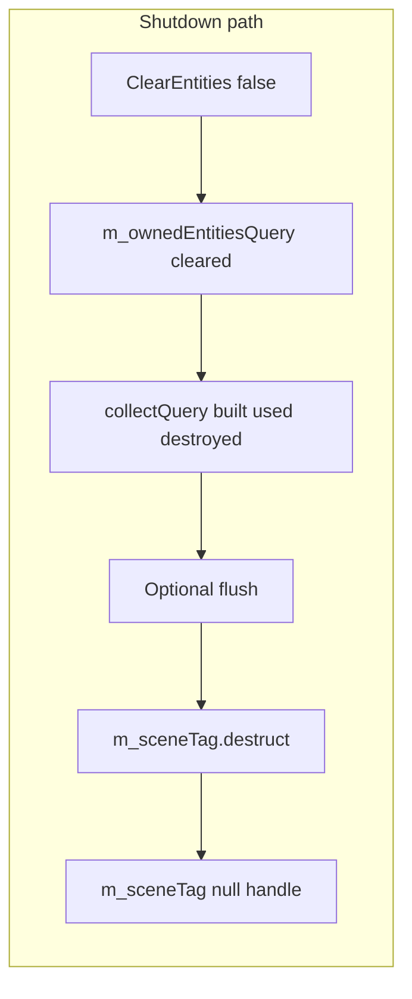

# Plan: Fix scene tag teardown (Flecs query locks)

## What the code should do (Flecs contract)

In your vendored Flecs ([`thirdparty/flecs/.../src/world.c`](thirdparty/flecs/9cdd27854682c79188bbccbb23147fa364895d14/src/world.c)), pair queries call `flecs_component_lock`, which records the **pair second** (your scene tag entity) in `locked_entities`. `ecs_delete` asserts that id is **not** delete-locked ([`entity.c`](thirdparty/flecs/9cdd27854682c79188bbccbb23147fa364895d14/src/entity.c)). Query teardown unlocks via `flecs_query_fini` → `flecs_component_unlock` ([`query/api.c`](thirdparty/flecs/9cdd27854682c79188bbccbb23147fa364895d14/src/query/api.c)).

So the **intended** fix in engine code is:

1. Ensure **no** `flecs::query` (or other Flecs query object) still exists whose terms include `SceneOwnership(m_sceneTag)`.
2. Optionally **flush** the world’s deferred pipeline so query finalisation is fully applied before `ecs_delete` on the tag.
3. Then **`m_sceneTag.destruct()`** (or C equivalent) and clear the C++ handle.

Current [`Scene::ClearEntities`](engine/wayfinder/src/scene/Scene.cpp) already clears `m_ownedEntitiesQuery`, builds a **local** `collectQuery`, iterates, assigns `collectQuery = {}`, and avoids rebuilding when `rebuildOwnedEntitiesQuery == false` (shutdown path). That is the right **shape**; the gap is whether something (deferred work, ordering, or a future second query site) still leaves the tag locked when you tried to delete it.

## Step 1 — Minimal implementation (preferred)

**File:** [`engine/wayfinder/src/scene/Scene.cpp`](engine/wayfinder/src/scene/Scene.cpp)

- In **`Shutdown()`**, after `ClearEntities(false)`:
  - Call a **single-frame flush** using the Flecs C++ API you already ship (e.g. `m_world.progress(0)` or the documented defer/merge pattern from your vendored headers — pick the one that matches Flecs 4’s “run systems / merge stage” semantics for an empty frame). Goal: ensure query `fini`/unlock has been applied.
  - If `m_sceneTag.is_valid()`, call **`m_sceneTag.destruct()`** (or `ecs_delete` via world) **before** setting `m_sceneTag = flecs::entity{}`.
- Tighten comments in [`Scene.h`](engine/wayfinder/src/scene/Scene.h) to describe this contract instead of “never delete the tag” if this works.

**Verification:** run `ctest --preset test` (or your usual preset). Existing tests such as [`tests/scene/ECSIntegrationTests.cpp`](tests/scene/ECSIntegrationTests.cpp) (`Shutdown destroys all scene-owned entities`, `Cross-scene entity isolation`) already exercise multi-entity and multi-scene worlds; add one focused test if needed:

- **Optional new test:** record `m_sceneTag.id()` before scope exit (via a small test-only helper or by exposing read-only tag id for tests only — avoid widening public API unless you already have a pattern). After `Scene` destruction, assert the tag id is **not** alive (proves `destruct` ran). If you prefer not to expose ids, assert **no** entity still has `SceneOwnership` for that scene by using a world query — but that requires knowing the tag id, so a minimal `GetSceneTagIdForTests()` or friend test may be justified.

## Step 2 — If Step 1 still trips Flecs debug assert

Treat “delete-locked after flush” as **engine policy**: **do not `ecs_delete` scene tag entities**; **reuse** them.

**Design:** a small **world-scoped tag pool** (singleton on `flecs::world` via `world.set<...>()` / `world.get_mut<...>()`, or a dedicated registry owned by whoever creates `Scene` — match your existing patterns).

- **`Acquire()`:** pop a recycled `flecs::entity` or create `world.entity()` if pool empty.
- **`Release(tag)`** (called from `Scene::Shutdown` after `ClearEntities(false)` and after both member/local queries are gone): **remove any components on the tag if needed**, then **push `tag` back to the pool** — **no `ecs_delete`**. Null `m_sceneTag` in `Scene`.
- **`Scene` constructor:** `m_sceneTag = pool.Acquire()` instead of always `m_world.entity()`.

**Properties:** bounds “leaked” tag ids to **at most** the maximum number of scene tags ever concurrently allocated (typically ~number of `Scene` instances over lifetime), not unbounded growth per shutdown.

**Tests:** extend ECS integration tests to create/destroy many `Scene` instances on one `flecs::world` in a loop and assert stable behaviour (no assert, world still usable). Optionally assert pool size caps growth after warm-up.

## Step 3 — Documentation / hygiene

- If Step 2 is required, add a short note to [`.github/AGENTS.md`](.github/AGENTS.md) (per project rules) describing: **pair-target entities used in queries are delete-locked in Flecs debug; scene tags are pooled or explicitly flushed before delete.**

## Is this the *right* plan, or is a bigger rewrite better?

**Short answer:** The phased plan (flush + explicit `destruct`, then tag pool if needed) is **correct relative to Flecs’s actual rules** — it is not a hack. Flecs debug locks **pair second** ids while queries that reference them exist; unlock happens in query `fini`. Your shutdown path already destroys those queries; flush addresses **ordering/defer** gaps. If that still fails, **never calling `ecs_delete` on the tag** (pool) is not “papering over” a bug — it matches the invariant **do not delete a pair target that has been part of active query terms** unless you fully control all query lifetimes (including Flecs internals).

**When a larger change *is* “better”** (you said migration/API churn is acceptable):

1. **Persistent scene identity entity (recommended if you want conceptual clarity over minimal diff)**  
   Treat the scene tag as a **scene root** that **outlives** `Scene::Shutdown` for as long as the `flecs::world` exists — shutdown only **clears** scene-owned entities (and maybe `ecs_clear` the root), but **does not delete** the root entity. New `Scene` session either **rebinds** to an existing root (by id/name) or **allocates once per world** from a small registry. This is **semantically** the same as a pool but reads as **architecture** (“scenes are stable nodes in the world”) rather than “workaround”.

2. **No Flecs entity as pair target for membership (maximum independence from this failure mode)**  
   Replace `SceneOwnership(sceneTag)` with something like **`SceneMembership { uint64_t SceneSessionId }`** (or a strong handle type) **without** using that id as a **pair second** in queries. Enumeration uses **authoritative C++ state** (the maps you already maintain) and/or **broad queries + filter**, not `query(..., SceneOwnership(tag))`. **Tradeoff:** you must decide **single source of truth** (Flecs vs `Scene`) and avoid drift; **benefit:** deletes of “scene identity” are no longer entangled with Flecs query locks at all.

3. **`flecs::world` per scene**  
   Shutdown destroys the whole world — **no** cross-scene entity references unless you add explicit bridges. **Largest** rip; usually wrong if the engine assumes one world for rendering/physics/editor.

**Recommendation:**  
- **Ship the small plan first** — it is low risk and validates whether the only issue was defer/ordering.  
- If you want the **“best” long-term shape** and are happy to rip: **persistent scene root + never delete** (option 1) is the cleanest **ECS-native** story; **numeric membership without pair queries** (option 2) is the cleanest **if you want scene membership to be data, not a Flecs relationship**.

## What we are explicitly not doing in the *minimal* track (unless you choose a larger pivot)

- Full migration to numeric membership or world-per-scene — **optional** larger tracks above; say the word and replace Step 1–2 with one of those designs instead.
